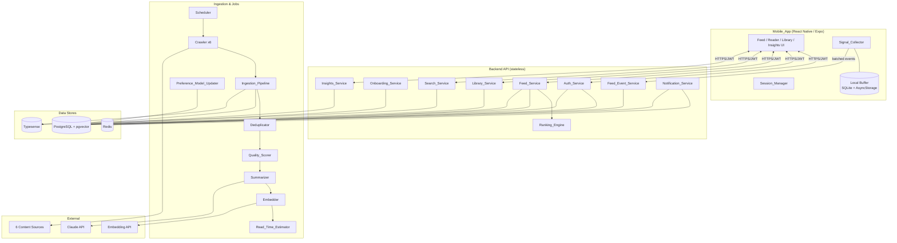
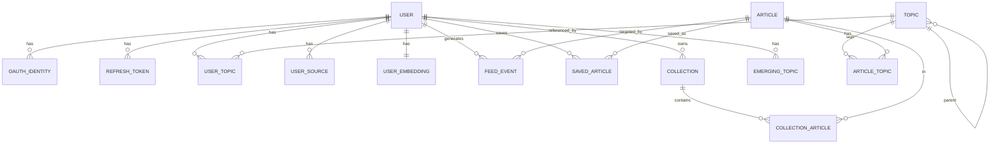

# Design Document

## Overview

Lumina is a mobile-first, anti-doomscroll knowledge feed system composed of three deployable tiers:

1. **Mobile_App** — a React Native (Expo) client that renders the card feed and reader, captures implicit reading signals, and enforces client-side anti-doomscroll constraints (soft feed end, session timer, daily-goal arc).
2. **Backend API** — a stateless HTTP service layer that hosts Auth_Service, Onboarding_Service, Feed_Service, Ranking_Engine, Feed_Event_Service, Library_Service, Search_Service, Insights_Service, and Notification_Service. It is the single authority for personalization, persistence, and authorization.
3. **Ingestion & Jobs tier** — long-running and scheduled workers: the Scheduler-driven Ingestion_Pipeline (Crawler, Deduplicator, Quality_Scorer, Summarizer, Embedder, Read_Time_Estimator) and the Preference_Model_Updater.

The design centers on a few high-leverage decisions:

- **Vector-native personalization.** Articles and users are represented as 1536-dimension embeddings. Relevance, related-articles, and serendipity all reduce to cosine-similarity operations over these vectors, stored in PostgreSQL with the `pgvector` extension. 1536 dimensions matches the requirement (Requirement 7.5, 9.x) and is the native width of common embedding models (e.g., OpenAI `text-embedding-3-small`).
- **Deterministic, composable ranking.** The Ranking_Engine is a pure scoring function: `score = Σ wᵢ·componentᵢ`, where each component is normalized to `[0,1]`. Keeping it pure makes it cheap to property-test exhaustively and keeps ranking reproducible for a given feed version.
- **Resilient, append-only signal collection.** The Signal_Collector batches events client-side with a durable local buffer, and the Feed_Event_Service ingests them idempotently using client-supplied event IDs, so retries and connectivity loss never corrupt the learning data (Requirements 12, 13).
- **Anti-doomscroll as a hard product invariant.** Soft feed end at 30 cards, serendipity injection every 10th card, and a non-blocking daily-goal arc are implemented as first-class behaviors, not user-configurable toggles (Requirements 10, 15, 16, 17).

### Technology Choices

| Concern | Choice | Rationale |
|---|---|---|
| Mobile client | React Native + Expo | Required by the feature; single codebase for iOS/Android. |
| API runtime | Node.js (TypeScript) + Fastify | Strong typing for request/response contracts; high-throughput JSON. |
| Primary datastore | PostgreSQL 15+ with `pgvector` | Relational integrity for users/articles/library plus native vector similarity for relevance, related articles, and centroids. |
| Full-text search | Typesense | Required (Requirement 20); typo-tolerant ranked full-text with faceted filters. |
| Cache / ephemeral state | Redis | Token denylist, login-attempt counters, account lockout, notification rate windows, feed-version page tracking. |
| Summarization | Claude API | Required (Requirement 7) for summary, tags, difficulty, read time. |
| Embeddings | Embedding model producing 1536-dim vectors | Required width (Requirement 7.5). |
| Client local storage | Expo SQLite (signal buffer) + AsyncStorage (search history, session state) | Durable buffer survives restarts (Requirement 12.10). |
| Scheduling | Cron-style worker (e.g., BullMQ repeatable jobs on Redis) | Per-source crawl intervals and the 6-hour preference job (Requirements 5.5, 14.1). |

## Architecture



### Request and Data Flows

**Authentication flow.** The Mobile_App attaches a short-lived JWT access token (15 min) to every protected request. On `401`, it transparently calls the refresh endpoint with the 30-day refresh token, then replays the original request. Logout revokes both tokens. (Requirement 2.)

**Feed assembly flow.** A `GET /feed` request triggers the Feed_Service to: (1) gather candidate articles excluding muted topics and prior skips; (2) score each candidate via the Ranking_Engine; (3) order by score; (4) inject serendipity cards at every 10th sequence position; (5) page the result, recording returned article IDs against the `feed_version` so subsequent cursor pages never repeat. (Requirements 8, 9, 10, 25.)

**Ingestion flow.** The Scheduler enqueues per-source crawl jobs at source-specific intervals. Each Crawler fetches items published since its last successful crawl (or a 24h backfill on first run), then each item flows through Deduplicator → Quality_Scorer → Summarizer → Embedder → storage. A failure in one source is recorded and isolated; other sources keep processing. (Requirements 5, 6, 7.)

**Learning flow.** The Signal_Collector records implicit events on-device, persists them to a durable local buffer, and flushes batches to the Feed_Event_Service every 30 seconds. Every 6 hours the Preference_Model_Updater recomputes each user's embedding, topic weights, and emerging topics from the last 30 days of events. (Requirements 12, 13, 14.)

### Service Boundaries

The API tier is stateless; all durable state lives in PostgreSQL, ephemeral coordination state in Redis, and the search index in Typesense. This separation lets the Ingestion/Jobs tier scale independently of request traffic, and lets the Ranking_Engine remain a pure in-process library invoked by the Feed_Service rather than a network hop.

## Components and Interfaces

Endpoints below are protected (require a valid access token) unless explicitly marked **public**.

### Auth_Service

Handles registration, login, refresh, logout, profile, account lockout. (Requirements 1, 2, 26.)

```
POST   /auth/register            (public)
POST   /auth/oauth/{provider}    (public)   provider ∈ {google, apple}
POST   /auth/login               (public)
POST   /auth/refresh             (public, refresh token)
POST   /auth/logout
GET    /auth/profile
PATCH  /auth/profile
```

- **Validation.** `validateEmail(email): bool` (RFC-style format, ≤254 chars), `validatePassword(pw): bool` (8–128 chars), `validateDailyGoal(n): bool` (integer 5–120), `validateDepth(d): bool` (∈ {quick, balanced, deep}), `validateDisplayName(s): bool` (1–50 chars). These are pure functions reused by registration, onboarding, and profile update.
- **Tokens.** `issueAccessToken(userId): JWT` (exp 15 min, unique `jti`), `issueRefreshToken(userId): token` (exp 30 days, hashed at rest). `logout` adds the access `jti` to a Redis denylist (TTL = remaining access lifetime) and revokes the refresh row.
- **Lockout.** `recordFailedLogin(accountId)` increments a Redis counter keyed by account with a 15-minute sliding window; at 5 failures within the window the account is locked for 15 minutes. All login/lockout responses use a single generic error to avoid account enumeration (Requirements 2.2, 2.7).

### Onboarding_Service

Serves the taxonomy and persists onboarding selections. (Requirements 3, 4.)

```
GET    /onboarding/topics        (public)
POST   /onboarding/complete
```

- `getTaxonomy(): Topic[]` returns slug, label, parent reference, color, icon name.
- `completeOnboarding(userId, {topicIds, depth, dailyGoal, sources})` validates count (3–20), existence of each topic id, depth, and daily goal; persists each **distinct** selected topic with `source = onboarding`, `weight = 1.0`; stores depth and daily goal; persists enabled/disabled state per source. All-or-nothing: on any validation failure nothing is persisted (Requirements 3.2–3.6).

### Feed_Service

Assembles paginated, ranked feeds; serves tabs, article detail, related articles, and topic muting. (Requirements 8, 9, 10, 11, 20, 25.)

```
GET    /feed?tab={foryou|<topic-slug>}&cursor={cursor}
GET    /feed/tabs
GET    /articles/{id}
GET    /articles/{id}/related
POST   /topics/{id}/mute
POST   /topics/{id}/unmute
```

- `assembleFeed(user, tab, cursor)`:
  1. Resolve candidate pool: exclude muted-topic articles, exclude prior-`skip` articles, restrict to topic when `tab` is a slug.
  2. Score via Ranking_Engine; sort descending by score.
  3. Inject serendipity cards at sequence positions that are multiples of 10.
  4. Page to 1–20 cards; record returned IDs under the `feedVersion`; emit `nextCursor` and `feedVersion`.
- `getTabs(user)`: returns `foryou` then 1–10 topic tabs ordered by descending weight, excluding weight-0 topics.
- `getRelated(articleId)`: top-5 distinct articles by descending cosine similarity to the source embedding, excluding the source (`pgvector` `<=>` operator). Returns `[]` when no candidates remain.
- `muteTopic` / `unmuteTopic`: idempotent persistence of muted state; 404 when the topic is not associated with the user.

### Ranking_Engine

A pure, in-process scoring library invoked by the Feed_Service. No I/O. (Requirement 9.)

```ts
interface RankingComponents { relevance: number; novelty: number; quality: number; recency: number; diversity: number; serendipity: number }
interface RankingWeights    { relevance: number; novelty: number; quality: number; recency: number; diversity: number; serendipity: number }

scoreArticle(article, userCtx, sessionCtx): number          // weighted sum, clamped [0,1]
relevance(userEmbedding | onboardingTopics, article): number // normalized cosine OR topic-match fallback
recency(ageHours): number                                    // exp decay, half-life 24h
diversityBonus(sourceCardCount, avgCardsPerSource): number   // [0, 0.20], component capped at 1.0
applyBanditTuning(weights, engagedTopics): RankingWeights    // adjustments [0, 0.15], re-normalized to sum 1.0
selectSerendipityArticle(userCtx, candidatePool): Article    // never-interacted topic, else farthest centroid
```

- Default weights: relevance 0.35, novelty 0.20, quality 0.20, recency 0.15, diversity 0.05, serendipity 0.05 (Requirement 9.4).
- `relevance` uses cosine similarity normalized from `[-1,1]` to `[0,1]` via `(cos + 1) / 2`; falls back to onboarding topic-match ratio when the user has no embedding (Requirements 9.2, 9.7).
- `recency(age) = 0.5 ^ (age / 24)`, giving 1.0 at age 0 and decreasing toward 0 (Requirement 9.3).

### Signal_Collector (Mobile_App)

Captures implicit behavior and reliably ships it. (Requirement 12.)

```ts
onCardVisible(articleId)        // ≥50% viewport → start dwell timer + impression
onCardHidden(articleId)         // <1500ms → skip; ≥1500ms → one dwell event w/ duration
onExpand(articleId)             // expand
onScrollDepth(articleId, p)     // emit when max scrolled proportion rises by ≥0.25
onLinkOut(articleId)            // link_out
enqueue(event)                  // append to durable buffer; evict oldest if >1000
flush()                         // every 30s; batches ≤200; retain on no-ack within 10s; retry
```

The buffer is durable (Expo SQLite) so unacknowledged events survive restarts and flush when connectivity returns. Each event carries a client-generated `clientEventId` (UUID) used for server-side idempotency.

### Feed_Event_Service

Ingests batched behavior events. (Requirement 13.)

```
POST   /events/batch     body: { events: FeedEvent[] }  (≤500)
```

- Rejects the entire batch if it exceeds 500 events.
- Validates each event's `type` against the allowed set; rejects invalid events individually while persisting valid ones.
- De-duplicates by `clientEventId`; duplicates are acknowledged as "already received" without creating new rows.
- Returns `{ persisted: number, rejected: RejectedEvent[], duplicates: number }`.

### Preference_Model_Updater (Job)

Runs every 6 hours per user. (Requirement 14.)

```ts
run(user):
  events = eventsInWindow(user, 30d)
  if events.isEmpty: return (leave embedding + weights unchanged)
  signalByArticle = weightedSignals(events)          // per-event-type weights
  engaged = articles where netSignal > 0
  userEmbedding = recencyWeightedCentroid(engaged)   // later last-event ⇒ strictly greater weight
  topicWeights = clamp(cosine(userEmbedding, topicCentroid), 0, 2)
  emerging = detectEmerging(events, 7d vs prior 7d)
```

### Library_Service

Saves, read-state, collections. (Requirements 21, 22.)

```
POST   /library/{articleId}            (save)
DELETE /library/{articleId}            (unsave)
PATCH  /library/{articleId}/read-state body: { state: read|unread }
GET    /library?state=&source=&cursor= (≤50/page)
POST   /collections                    body: { name(1-100), color, icon }
PATCH  /collections/{id}
DELETE /collections/{id}
POST   /collections/{id}/articles      body: { articleId }
GET    /collections/{id}/articles      (paginated)
```

Saving is idempotent (no duplicate row, no duplicate `save` event). Adding an unsaved article to a collection is rejected. Mutations on another user's collection return an authorization error (Requirements 21.5, 22.6, 22.7).

### Search_Service

Full-text search via Typesense. (Requirement 20.)

```
GET    /search?q=&source=&topic=&readTime=&dateRange=&cursor=
```

Validates query length 1–200 (rejects empty/whitespace-only/>200); applies all provided filters conjunctively; returns matches by descending relevance, empty set on no match. Search history is client-side (≤50 unique, oldest-evicted).

### Insights_Service

Reading stats, topic trends, emerging interests, narrative. (Requirements 24, 25.)

```
GET    /insights
GET    /topics/weights
POST   /insights/emerging/{topicId}/accept
```

### Notification_Service

Push hygiene. (Requirement 18.)

```
(internal) sendDaily(user)
PATCH  /notifications/preferences  body: { enabled: bool }
```

Disabled by default at account creation; at most 1 push per rolling 24h when enabled; fixed copy "Your curiosity feed has new picks."; never sends when disabled.

### Session_Manager (Mobile_App)

Anti-doomscroll enforcement. (Requirements 15, 16.)

```ts
startSession()                  // viewedCount = 0
onCardEntered()                 // viewedCount++; at 30 → session-end screen (shows minutes)
keepGoing()                     // dismiss, reset viewedCount = 0, resume loading
endSession()                    // on feed exit
tickReadingTime()               // arc = min(accumulatedMin / dailyGoal, 1.0); update ≤ once/60s
onLocalMidnight()               // reset accumulated reading time + arc
```

## Data Models

### PostgreSQL Schema (logical)



**user**

| column | type | notes |
|---|---|---|
| id | uuid PK | |
| email | citext UNIQUE | ≤254 chars, valid format |
| password_hash | text NULL | null for OAuth-only accounts |
| display_name | varchar(50) | |
| avatar_url | text NULL | |
| depth_preference | enum(quick,balanced,deep) | default `balanced` |
| daily_goal_minutes | int | 5–120, default 15 |
| push_enabled | bool | default `false` |
| onboarding_completed_at | timestamptz NULL | null ⇒ route to onboarding |
| created_at | timestamptz | |

**oauth_identity**: `id`, `user_id FK`, `provider` enum(google,apple), `provider_user_id`, `email`; UNIQUE(provider, provider_user_id).

**refresh_token**: `id`, `user_id FK`, `token_hash`, `expires_at`, `revoked_at NULL`, `created_at`.

**topic**: `id`, `slug` UNIQUE, `label`, `parent_id FK NULL`, `color`, `icon_name`, `centroid vector(1536) NULL`.

**user_topic**: `user_id FK`, `topic_id FK`, `weight numeric` (0.0–2.0), `source` enum(onboarding,inferred), `muted bool` default false, `created_at`; PK(user_id, topic_id).

**user_source**: `user_id FK`, `source` enum(wikipedia,medium,hacker_news,arxiv,mit_news,quanta), `enabled bool`; PK(user_id, source).

**article**

| column | type | notes |
|---|---|---|
| id | uuid PK | |
| url | text | |
| url_hash | char(64) UNIQUE | SHA-256 of normalized URL |
| source | enum(...6...) | |
| title | text | |
| summary | text NULL | null while unsummarized |
| full_text | text NULL | cleaned; null ⇒ reader shows external link |
| embedding | vector(1536) NULL | required before storage of a complete article |
| quality_score | numeric | 0.0–1.0, ≥0.3 to be stored |
| difficulty | enum(introductory,intermediate,advanced) NULL | |
| read_time_minutes | int | ≥1 |
| summarization_status | enum(pending,summarized,unsummarized) | |
| published_at | timestamptz | |
| ingested_at | timestamptz | |

**article_topic**: `article_id FK`, `topic_id FK`, `confidence numeric` (0.0–1.0); PK(article_id, topic_id).

**user_embedding**: `user_id FK PK`, `embedding vector(1536)`, `updated_at`. Absence of a row ⇒ "no User_Embedding" (triggers Ranking_Engine fallback, Requirement 9.7).

**feed_event**

| column | type | notes |
|---|---|---|
| id | uuid PK | |
| client_event_id | uuid | UNIQUE(user_id, client_event_id) for idempotency |
| user_id | FK | |
| article_id | FK NULL | null for session_end |
| topic_id | FK NULL | set for mute_topic |
| type | enum(impression,dwell,expand,scroll_depth,save,unsave,share,link_out,skip,mute_topic,session_end) | |
| payload | jsonb | e.g. `{ dwellMs }`, `{ scrollProportion }` |
| occurred_at | timestamptz | client-supplied occurrence time |
| created_at | timestamptz | server receipt time |

**saved_article**: `user_id FK`, `article_id FK`, `read_state` enum(read,unread) default unread, `saved_at`; PK(user_id, article_id).

**collection**: `id`, `user_id FK`, `name varchar(100)`, `color`, `icon`, `created_at`.

**collection_article**: `collection_id FK`, `article_id FK`, `added_at`; PK(collection_id, article_id).

**emerging_topic**: `user_id FK`, `topic_id FK`, `detected_at`; PK(user_id, topic_id).

**crawl_state**: `source PK`, `last_successful_crawl_at timestamptz NULL`.

**crawl_failure**: `id`, `source`, `error`, `occurred_at`.

### Redis Keys

| key | purpose | TTL |
|---|---|---|
| `denylist:jti:{jti}` | revoked access tokens | remaining access lifetime |
| `login:fail:{userId}` | failed-login counter | 15 min sliding |
| `lockout:{userId}` | account lockout flag | 15 min |
| `feedver:{feedVersion}:returned` | set of article IDs already returned in a feed version | feed session TTL |
| `notif:last:{userId}` | last push timestamp | 24 h |

### Typesense Collection (`articles`)

Indexed fields: `id`, `title`, `summary`, `full_text`, `source` (facet), `topic_slugs[]` (facet), `read_time_minutes` (facet/range), `published_at` (range). Kept in sync by the Ingestion_Pipeline on store.

### Client Local Storage

- **Signal buffer (SQLite):** `feed_event(client_event_id PK, type, article_id, payload, occurred_at, acknowledged)`. Capacity 1000; oldest non-acknowledged evicted on overflow.
- **Search history (AsyncStorage):** ordered list of ≤50 unique queries, most-recent-first.
- **Session state (AsyncStorage):** `viewedCount`, `accumulatedReadingMinutes`, `lastArcUpdateAt`, `dailyResetDate`.

### Key Data Types (TypeScript)

```ts
type Source = 'wikipedia' | 'medium' | 'hacker_news' | 'arxiv' | 'mit_news' | 'quanta';
type Difficulty = 'introductory' | 'intermediate' | 'advanced';
type Depth = 'quick' | 'balanced' | 'deep';
type FeedEventType =
  | 'impression' | 'dwell' | 'expand' | 'scroll_depth' | 'save' | 'unsave'
  | 'share' | 'link_out' | 'skip' | 'mute_topic' | 'session_end';

interface Article {
  id: string; url: string; source: Source; title: string;
  summary: string | null; fullText: string | null;
  embedding: number[] | null;            // length 1536
  qualityScore: number;                  // [0,1]
  difficulty: Difficulty | null;
  readTimeMinutes: number;               // >= 1
  topics: { topicId: string; confidence: number }[];
  publishedAt: string; ingestedAt: string;
}

interface SummarizerOutput {
  summary: string;                       // 2-3 sentences
  tags: string[];                        // 1-4 taxonomy slugs
  difficulty: Difficulty;
  readTimeMinutes: number;               // 1-120
}
```

## Correctness Properties

*A property is a characteristic or behavior that should hold true across all valid executions of a system — essentially, a formal statement about what the system should do. Properties serve as the bridge between human-readable specifications and machine-verifiable correctness guarantees.*

The properties below are universally quantified and are intended to be implemented as property-based tests (minimum 100 generated iterations each). They concentrate on the parts of Lumina with genuine input-varying logic: the pure Ranking_Engine, the Preference_Model_Updater, the input validators, the idempotent Feed_Event_Service, the durable Signal_Collector buffer, feed assembly/pagination, and the library/collections authorization rules. Pure UI rendering, scheduling cadence, and external-service wiring are intentionally excluded here and are covered by example, snapshot, smoke, and integration tests in the Testing Strategy.

### Property 1: Input validators accept exactly the allowed ranges

*For any* candidate value, each pure validator accepts the value if and only if it lies within its documented range: `validateEmail` iff the string is a well-formed email of ≤254 characters; `validatePassword` iff length ∈ [8,128]; `validateDailyGoal` iff it is an integer ∈ [5,120]; `validateDepth` iff ∈ {quick, balanced, deep}; `validateDisplayName` iff length ∈ [1,50]; collection-name validation iff length ∈ [1,100]. Rejection never mutates persisted state.

**Validates: Requirements 1.3, 1.4, 1.7, 1.8, 3.4, 22.1, 26.2, 26.3**

### Property 2: Authentication failures are indistinguishable

*For any* failed authentication — an unknown email, a known email with a wrong password, an expired/malformed/invalidated refresh token, or a missing/invalid access token on a protected route — the returned error body and status code are identical to those of every other failure of its class, revealing nothing about which factor failed or whether the account exists.

**Validates: Requirements 2.2, 2.4, 2.6**

### Property 3: Account lockout triggers exactly at the threshold within the window

*For any* timeline of failed login attempts for a single account, the account is locked if and only if at least 5 of those failures fall within a 15-minute sliding window, and once locked it remains locked for 15 minutes regardless of further attempts.

**Validates: Requirements 2.7**

### Property 4: Onboarding persistence is all-or-nothing and normalized

*For any* onboarding completion request, if the topic count is outside [3,20], any topic id is unrecognized, the depth is invalid, or the daily goal is outside [5,120], then nothing is persisted; otherwise each *distinct* selected topic is persisted exactly once with `source = onboarding` and `weight = 1.0`, and the depth and daily goal are stored on the account.

**Validates: Requirements 3.2, 3.3, 3.4, 3.5, 3.6**

### Property 5: URL-hash deduplication discards exactly colliding articles

*For any* incoming article and any set of stored articles, the article is discarded as a duplicate if and only if the SHA-256 hash of its normalized URL equals the URL hash of some stored article; normalized-URL equality and hash equality always agree.

**Validates: Requirements 6.1, 6.2**

### Property 6: Quality score is bounded and gates storage

*For any* article, the quality score is within [0.0, 1.0], and the article is permitted to be stored if and only if its quality score is ≥ 0.3.

**Validates: Requirements 6.3, 6.4**

### Property 7: Stored articles satisfy the completeness invariant

*For any* article that reaches the stored state, it has a non-null URL, source, title, summary, cleaned full text, a quality score ≥ 0.3, an embedding vector of exactly 1536 dimensions, and a read time that is a whole number of minutes ≥ 1.

**Validates: Requirements 6.5, 6.6, 7.5**

### Property 8: Summarizer output respects all bounds

*For any* accepted Summarizer result, the summary contains 2–3 sentences, the tag count is between 1 and 4 with every tag drawn from the taxonomy, the difficulty ∈ {introductory, intermediate, advanced}, the read time ∈ [1,120] minutes, and every produced topic association carries a confidence in [0.0, 1.0].

**Validates: Requirements 7.1, 7.2**

### Property 9: Pipeline retries are bounded and end in a consistent terminal state

*For any* sequence of summarization or embedding failures, the number of attempts never exceeds 3; on summarization exhaustion the article is retained in the unsummarized state and no further attempts occur; on embedding exhaustion the article is not stored.

**Validates: Requirements 7.3, 7.4, 7.6, 7.7**

### Property 10: Feed pages are bounded in size

*For any* feed request (initial or cursored), the number of returned articles is between 1 and 20, and the response includes a next-page cursor and a feed version identifier.

**Validates: Requirements 8.1**

### Property 11: A feed version never repeats an article across pages

*For any* sequence of cursor pages drawn from the same feed version, no article id appears in more than one page; the concatenation of all returned pages contains only distinct article ids.

**Validates: Requirements 8.2**

### Property 12: Topic-tab feeds are restricted to the topic

*For any* feed request whose tab equals an existing topic slug, every returned article is associated with that topic.

**Validates: Requirements 8.4**

### Property 13: Active tabs are filtered and ordered

*For any* user, the active-tabs response begins with `foryou` followed by 1–10 topic tabs, includes only topics whose weight is strictly greater than 0, and orders those topic tabs by descending current topic weight.

**Validates: Requirements 8.5**

### Property 14: Excluded articles never appear in the feed

*For any* assembled feed response, no article appears that the user has previously skipped, and no article appears that is associated with a currently muted topic.

**Validates: Requirements 8.6, 25.2**

### Property 15: Ranking score and every component are bounded in [0,1]

*For any* candidate article and user context — including the no-embedding fallback that uses the onboarding topic-match ratio and the cosine-to-[0,1] normalization `(cos+1)/2` — each of the six components and the final weighted-sum score lie within [0.0, 1.0].

**Validates: Requirements 9.1, 9.2, 9.7**

### Property 16: Recency decay is monotonic and anchored

*For any* two article ages `a ≤ b` (hours), `recency(a) ≥ recency(b)`, with `recency(0) = 1.0`, `recency` strictly decreasing for positive ages, `recency(24) = 0.5` (24-hour half-life), and `recency` approaching 0 as age grows.

**Validates: Requirements 9.3**

### Property 17: Component weights always sum to 1.0

*For any* weight configuration — the defaults (0.35, 0.20, 0.20, 0.15, 0.05, 0.05) and any bandit-tuned weights where engaged-topic adjustments lie in [0.0, 0.15] — the six component weights sum to 1.0 after re-normalization.

**Validates: Requirements 9.4, 9.6**

### Property 18: Diversity bonus is bounded and the component is capped

*For any* session card distribution, the diversity bonus added for an under-represented source lies within [0.0, 0.20], the bonus is applied only when that source has supplied fewer cards than the average per enabled source, and the resulting diversity component never exceeds 1.0.

**Validates: Requirements 9.5**

### Property 19: Serendipity cards are injected at every 10th position

*For any* assembled feed sequence, exactly one Serendipity_Card occupies each position that is a multiple of 10 (positions 10, 20, 30, …) and no non-multiple-of-10 position is a Serendipity_Card.

**Validates: Requirements 10.1**

### Property 20: Serendipity selection follows the never-interacted-then-farthest rule

*For any* user and candidate pool, if a topic exists for which the user has no recorded Feed_Event against any associated article, the selected Serendipity_Card belongs to such a topic; otherwise it belongs to the topic whose centroid is farthest (largest cosine distance) from the User_Embedding.

**Validates: Requirements 10.2, 10.3**

### Property 21: Related articles are distinct, capped, ordered, and exclude the source

*For any* source article and candidate set, the related result excludes the source article, contains only distinct articles, has size `min(candidatesRemaining, 5)` (empty when none remain), and is ordered by non-increasing cosine similarity to the source embedding.

**Validates: Requirements 11.1, 11.2, 11.3**

### Property 22: Dwell duration classifies into exactly one of skip or dwell

*For any* card visibility episode, if the card exits within 1500 ms of becoming ≥50% visible the collector records a `skip` and no `dwell`; if it exits at or after 1500 ms it records exactly one `dwell` event carrying the tracked duration and no `skip`.

**Validates: Requirements 12.4, 12.5**

### Property 23: Scroll-depth events fire only on a 0.25 increase in maximum depth

*For any* monotonic-or-noisy sequence of reader scroll proportions, a `scroll_depth` event is emitted exactly when the maximum scrolled proportion rises by at least 0.25 since the last emission, and each emitted event carries the new maximum.

**Validates: Requirements 12.6**

### Property 24: Transmission batches never exceed 200 events

*For any* accumulated set of buffered events flushed at a transmission tick, the events are partitioned into batches each containing at most 200 Feed_Events, and the union of batches equals the set flushed.

**Validates: Requirements 12.8**

### Property 25: The local buffer enforces capacity by evicting oldest-first

*For any* sequence of enqueued events, the buffer never holds more than 1000 events; when an insertion would exceed 1000, the oldest stored event is evicted first, so the retained set is exactly the 1000 most recent events in arrival order.

**Validates: Requirements 12.11**

### Property 26: Event ingestion is idempotent on clientEventId

*For any* batch, ingesting it and then ingesting it again (or ingesting any batch containing previously seen `clientEventId`s) creates no additional rows for the duplicates and acknowledges them as already received; the final stored set is identical to ingesting each distinct `clientEventId` exactly once.

**Validates: Requirements 13.4**

### Property 27: Partial validation persists valid events and accounts for all events

*For any* batch of ≤500 events, every event with a type in the allowed set is persisted with its user, article, type, payload, and occurrence timestamp, every event with an out-of-set type is rejected and reported, and `persisted + rejected + duplicates` equals the batch size.

**Validates: Requirements 13.1, 13.2, 13.3**

### Property 28: Over-limit batches are rejected atomically

*For any* batch containing more than 500 events, no event from the batch is persisted and a validation error indicating the batch-size limit is returned.

**Validates: Requirements 13.5**

### Property 29: Event-type signal weighting is deterministic and correctly scaled

*For any* set of Feed_Events, the computed interest signal equals the sum of per-event weights using impression 0.05, dwell 0.15, expand 0.35, scroll_depth 0.10 × scrollProportion, save 0.50, unsave 0.0, share 0.60, link_out 0.45, skip −0.20, session_end 0.0, and mute_topic −1.00, with scrollProportion clamped to [0.0, 1.0].

**Validates: Requirements 14.3**

### Property 30: The User_Embedding is the recency-weighted centroid of engaged articles, and recency strictly breaks ties

*For any* 30-day event history, the recomputed embedding is the recency-weighted centroid over exactly the engaged articles (those with net weighted signal > 0); and for any two engaged articles with equal net weighted signal, the one whose most recent Feed_Event occurred later contributes a strictly greater weight to the centroid.

**Validates: Requirements 14.4, 14.5**

### Property 31: Recomputed topic weights are clamped to [0,2]

*For any* recomputed User_Embedding and topic centroid, the resulting topic weight equals the cosine similarity between them clamped to the range [0.0, 2.0].

**Validates: Requirements 14.6**

### Property 32: Emerging-topic classification follows the growth rule

*For any* topic with recent-7-day aggregate signal `r` and preceding-7-day aggregate signal `p`, the topic is recorded as emerging if and only if `r > 1.2 · p`, or `p ≤ 0` and `r > 0`.

**Validates: Requirements 14.7**

### Property 33: An empty 30-day window leaves the model unchanged

*For any* user with no Feed_Events in the entire 30-day window, running the Preference_Model_Updater leaves the User_Embedding and every topic weight exactly as they were (a no-op).

**Validates: Requirements 14.9**

### Property 34: Soft feed end triggers at 30 cards and resets on continue

*For any* sequence of card-entry events in a session, the session-end screen is presented exactly when the cumulative count of cards that entered the viewport reaches 30; tapping "Keep going" resets the count to 0 so that the next session-end occurs after another 30 cards.

**Validates: Requirements 15.2, 15.4**

### Property 35: The daily-goal arc is the capped progress ratio

*For any* accumulated reading minutes `m` and daily goal `g`, the arc fill equals `min(m / g, 1.0)`; it never exceeds 1.0 and never wraps, remaining fully filled while `m ≥ g` until the next local-midnight reset.

**Validates: Requirements 16.1, 16.5**

### Property 36: Notification delivery respects default-off, suppression, and the 24-hour rate limit

*For any* timeline of send attempts, no push is delivered while notifications are disabled (the default at account creation), and while enabled at most one push is delivered within any rolling 24-hour period.

**Validates: Requirements 18.1, 18.2, 18.4**

### Property 37: The "Go deeper" section is gated by the related-count threshold

*For any* article with `n` available related articles, the Reader presents a "Go deeper" section containing `min(n, 5)` related articles when `n ≥ 3`, and omits the section entirely when `n < 3`.

**Validates: Requirements 19.4, 19.5**

### Property 38: Search query validation rejects empty, whitespace-only, and oversized queries

*For any* query string, the search is performed if and only if its trimmed length is in [1, 200]; empty, whitespace-only, or >200-character queries are rejected with a validation error and no search is executed.

**Validates: Requirements 20.5**

### Property 39: Search filters are applied conjunctively

*For any* search request with a set of source, topic, read-time, and date-range filters, every returned article satisfies *all* specified filters simultaneously.

**Validates: Requirements 20.7**

### Property 40: Search history is bounded, unique, and recency-ordered

*For any* sequence of non-empty searched queries, the stored history contains at most 50 entries, holds no duplicate query, is ordered most-recent-first, and on overflow evicts the oldest query first; re-searching an existing query moves it to the front without growing the count.

**Validates: Requirements 20.8**

### Property 41: Saving is idempotent

*For any* article and library state, saving an article not already saved adds it with read state `unread` and records exactly one `save` Feed_Event, while saving an already-saved article leaves the article and its read state unchanged and records no additional `save` event.

**Validates: Requirements 21.1, 21.5**

### Property 42: The saved-articles list is page-bounded and filter-consistent

*For any* library query, each page returns at most 50 articles with a next-page cursor, and every returned article matches the requested read-state and source filters.

**Validates: Requirements 21.4**

### Property 43: Deleting a collection preserves the underlying saved articles

*For any* collection and its article associations, deleting the collection removes the collection and all of its associations while every previously saved article remains in the user's library.

**Validates: Requirements 22.4**

### Property 44: Collection mutations enforce save-precondition and ownership

*For any* collection mutation request, adding an article that is not saved in the user's library is rejected and leaves the collection unchanged, and any update/add/delete targeting a collection owned by a different user is rejected with an authorization error and leaves the collection unchanged.

**Validates: Requirements 22.6, 22.7**

### Property 45: Mute state round-trips and is idempotent

*For any* topic associated with a user, muting then unmuting (or unmuting then muting) returns the topic to its original muted state; muting an already-muted topic or unmuting an already-unmuted topic preserves the state and returns success.

**Validates: Requirements 25.3, 25.4, 25.5**

### Property 46: Mute-topic selects the highest-confidence topic

*For any* article with a non-empty set of topic associations, selecting "mute topic" records a `mute_topic` Feed_Event for the topic with the highest association confidence for that article.

**Validates: Requirements 23.4**

### Property 47: Insights monthly aggregates are computed from in-month events

*For any* event history, the insights response reports the count of articles read in the current calendar month, the total quality reading time in whole minutes for the month excluding `skip` events, the count of topics first engaged in the month, and a per-source reading-time breakdown in whole minutes for the month.

**Validates: Requirements 24.1, 24.3**

### Property 48: Topic breakdown is trend-classified and weight-ordered

*For any* user's topics, the breakdown is sorted by descending weight, and each topic is labelled growing when its 7-day signal increased by more than 10%, fading when it decreased by more than 10%, and steady when the change is within ±10%.

**Validates: Requirements 24.2**

### Property 49: Emerging interests are capped and exclude already-added topics

*For any* detection result, the insights response returns at most 3 emerging topics, and none of them is a topic the user has already explicitly added.

**Validates: Requirements 24.4**

### Property 50: Accepting an emerging topic transitions it into the user's topics

*For any* topic in the user's current emerging list, accepting it adds the topic to the user's topics with `source = inferred` and removes it from the emerging list; accepting a topic not in the list leaves all state unchanged and returns an error.

**Validates: Requirements 24.5, 24.6**

### Property 51: The feed-evolution narrative is bounded to 1–3 sentences

*For any* insights request with reading history, the returned narrative contains between 1 and 3 sentences.

**Validates: Requirements 24.7**

## Error Handling

Lumina's error handling is layered to match the three-tier architecture, with a consistent principle: validation and authorization failures are reported precisely enough to be actionable but never leak sensitive existence or credential information, and ingestion/jobs failures are isolated so one bad source, article, or event can never halt the rest of the system.

### Cross-cutting conventions

- **Uniform error envelope.** Every API error returns `{ error: { code, message, details? } }` with an appropriate HTTP status. `code` is a stable machine string (e.g. `VALIDATION_ERROR`, `AUTH_FAILED`, `NOT_FOUND`, `CONFLICT`, `FORBIDDEN`, `RATE_LIMITED`). `details` carries per-field validation context but never echoes secrets.
- **Validation before side effects.** All write endpoints validate the full request and authorize the actor before any persistence, so a rejected request is guaranteed to leave state unchanged (the atomicity relied on by Properties 1, 4, 28, 44).
- **Idempotent retries.** Endpoints that clients retry (event ingestion, save, mute) are idempotent, so transport-level retries never corrupt state.

### Authentication and authorization errors (Requirements 1, 2, 26)

- **Generic, indistinguishable auth failures.** Unknown email, wrong password, expired/invalidated tokens, and lockout all return the same `401 AUTH_FAILED` body with no field-level distinction, defeating account enumeration (Property 2). Timing is normalized (a constant-work password verification is performed even for unknown emails) to avoid timing side channels.
- **Account lockout.** After 5 failures within the 15-minute window the account returns `401 AUTH_FAILED` for the 15-minute lockout regardless of credential correctness (Property 3). Lockout state lives in Redis (`lockout:{userId}`) with a TTL so it self-heals.
- **Registration conflicts vs validation.** A duplicate email returns `409 CONFLICT` identifying the email as already registered (Requirement 1.2); malformed email, bad password length, or out-of-range daily goal return `400 VALIDATION_ERROR` with the offending field and no account created (Requirement 1.3, 1.4, 1.8).
- **OAuth failures.** An unsupported provider or unverifiable identity returns an error indicating OAuth could not be completed, and neither creates nor links an account (Requirement 1.6).
- **Protected routes.** Missing/malformed/expired/denylisted access tokens return `401` via a single middleware (Requirements 2.6, 26.4); revoked `jti`s are checked against the Redis denylist.

### Onboarding and profile validation (Requirements 3, 4, 26)

- Onboarding completion is **all-or-nothing**: topic count outside [3,20], unrecognized topic ids, invalid depth, or out-of-range daily goal each yield `400 VALIDATION_ERROR` (listing unrecognized ids where relevant) and persist nothing (Property 4). Profile updates behave the same way, leaving the stored profile unchanged on any invalid field (Property 1).
- If initial feed assembly fails after a *valid* onboarding submission, the service returns an error indicating the initial feed could not be assembled while **preserving** the persisted onboarding state (Requirement 4.7), so the client can retry feed loading without re-onboarding.

### Ingestion and source failures (Requirements 5, 6, 7)

- **Per-source isolation.** A crawler timeout (>30 s) or error response records a `crawl_failure` row identifying the source and continues with the remaining sources; even a failure to write the failure row does not stop the cycle (Requirements 5.6, 5.7). Each source's job is independent so a single failing source cannot block the others.
- **Per-article isolation.** Within a source, each item flows through the pipeline independently; a dedup discard, sub-threshold quality score (<0.3), or summarization/embedding exhaustion affects only that item.
- **Bounded retries with explicit terminal states.** Malformed summarizer JSON is rejected and retried up to 3 attempts, after which the article is retained `unsummarized` and left in the feed-eligible-but-unsummarized state (Requirements 7.3, 7.4). Embedding failures retry up to 3 attempts and **block storage**; on exhaustion the article is not stored and the failure is logged (Requirements 7.6, 7.7). Attempt counts are capped (Property 9).
- **Completeness gate.** Storage is refused unless the article has all required fields including a 1536-dim embedding and read time ≥ 1 (Property 7), so partially-processed articles never become visible.

### Feed, ranking, and serendipity errors (Requirements 8, 9, 10, 11, 20)

- **Cursor and tab validation.** A malformed/expired/unknown cursor returns `400 VALIDATION_ERROR` (cursor invalid) and returns no articles (Requirement 8.7); a tab that is neither `foryou` nor an existing topic slug returns `400 VALIDATION_ERROR` (tab invalid) with no articles (Requirement 8.8).
- **Graceful degradation.** Ranking is a pure in-process function with clamped outputs, so it cannot throw on numeric edge cases — components are clamped into [0,1] (Property 15). When a user has no embedding, relevance falls back to onboarding topic-match rather than erroring (Requirement 9.7).
- **Article detail and related.** A request for a nonexistent article returns `404 NOT_FOUND` with no partial detail (Requirement 20.2); if related-article retrieval fails for an existing article, the detail is still returned **without** related articles rather than failing the whole request (Requirement 20.3, 11.4 returns not-found only when the *source* article is missing).

### Signal collection and ingestion errors (Requirements 12, 13)

- **Durable client buffer.** Unacknowledged events persist in Expo SQLite and survive restarts; a flush with no acknowledgement within 10 s is treated as failed, the events are retained, and the batch is retried (Requirements 12.9, 12.10). Buffer overflow evicts oldest-first rather than dropping new events arbitrarily (Property 25).
- **Server-side robustness.** A batch >500 is rejected atomically (`400`, nothing persisted, Property 28); within an accepted batch, invalid event types are rejected individually and reported while valid events persist (Property 27); duplicate `clientEventId`s are absorbed idempotently (Property 26). The acknowledgement always reconciles `persisted + rejected + duplicates` against the batch size.

### Library, collections, and search errors (Requirements 20, 21, 22)

- Unsaving an article that is not saved returns an error indicating it is not saved and records no `unsave` event (Requirement 21.6). Adding an unsaved article to a collection is rejected with a "must be saved first" error leaving the collection unchanged (Requirement 22.6).
- **Ownership authorization.** Any update/add/delete against a collection owned by another user returns `403 FORBIDDEN` and leaves the collection unchanged (Property 44).
- Search rejects empty/whitespace-only/>200-character queries with `400 VALIDATION_ERROR` and performs no search (Property 38); a valid query with no matches returns an empty set rather than an error (Requirement 20.6).

### Mute, insights, and notification errors (Requirements 24, 25, 18)

- Muting/unmuting a topic not associated with the user returns a not-found error (Requirement 25.6); idempotent mute/unmute on an already-in-state topic returns success (Property 45).
- Accepting an emerging topic that is not in the user's emerging list returns an error and leaves state unchanged (Requirement 24.6); with no reading history, insights return zero counts, empty breakdowns, and an insufficient-history narrative rather than failing (Requirements 24.8, 24.10).
- The Notification_Service silently suppresses (does not error) when notifications are disabled or when the 24-hour window already contains a send, since these are expected hygiene constraints rather than failures (Property 36).

## Testing Strategy

Lumina uses a layered strategy that pairs **example-based unit tests** (concrete behaviors and error branches), **property-based tests** (universal invariants over generated inputs), and **integration/smoke tests** (external services, scheduling, and infrastructure wiring). Property tests carry the load of input-space coverage; unit tests pin down specific examples and edge branches; integration tests verify the parts that do not vary meaningfully with input.

### Property-based testing

- **Library.** Use `fast-check` (TypeScript) for the API and shared logic, executed under the existing test runner (Jest or Vitest, `--run`/single-execution mode). Do not hand-roll a generator framework.
- **Iterations.** Each property test runs a minimum of 100 generated cases (`{ numRuns: 100 }` or higher for cheap pure functions).
- **Traceability tag.** Every property test is annotated with a comment in the form:
  `// Feature: lumina, Property {number}: {property_text}`
  referencing the matching property in the Correctness Properties section.
- **Single test per property.** Each correctness property is implemented by exactly one property-based test.

**Pure Ranking_Engine invariants.** Because the Ranking_Engine performs no I/O, it is the highest-value PBT target and is tested in isolation:
- Generators produce articles (random 1536-dim embeddings, ages, quality scores, source distributions, topic associations) and user contexts (with and without a User_Embedding, varying onboarding topics, session card counts).
- Properties 15–18, 20 assert score/component bounds in [0,1], recency monotonicity with a 24-hour half-life and `recency(0)=1`, weight normalization to 1.0 for both default and bandit-tuned weights, diversity-bonus bounds and the 1.0 cap, and the serendipity selection rule. Property 19 asserts the every-10th-position injection cadence over generated assembled sequences.
- A model-based check compares the normalized-cosine relevance against an independently computed `(cos+1)/2` reference.

**Pure Preference_Model_Updater invariants.** The updater is tested as a pure function of an event history plus article embeddings:
- Generators emit 30-day event timelines with varied event types, timestamps, and scroll proportions, plus engaged/disengaged article embeddings.
- Property 29 checks the event-type weighting (including `scroll_depth × proportion`). Property 30 checks that the new embedding is the recency-weighted centroid over exactly the net-positive ("engaged") articles, and the subtle recency tie-break (equal net signal ⇒ a strictly larger weight for the article whose most recent event is later) is asserted by constructing pairs with identical net signal and differing last-event times. Property 31 checks the [0,2] topic-weight clamp, Property 32 the emerging-topic growth rule, and Property 33 the empty-window no-op.

**Other property targets.** Validators (Property 1), auth lockout/enumeration (Properties 2–3), onboarding atomicity (Property 4), dedup/quality (Properties 5–7), summarizer/embedding bounds and bounded retries (Properties 8–9), feed pagination/exclusion/tabs (Properties 10–14), serendipity/related (Properties 19–21), signal thresholds/batching/buffer (Properties 22–25), ingestion idempotency/partial-validation/atomicity (Properties 26–28), anti-doomscroll (Properties 34–35), notifications (Property 36), reader gating (Property 37), search (Properties 38–40), library/collections (Properties 41–45), mute-topic selection (Property 46), and insights (Properties 47–51). Idempotency and round-trip properties (26, 41, 45, 50) re-apply operations and assert state equivalence.

### Unit (example-based) testing

Unit tests cover the concrete scenarios and error branches that are not universal:
- Auth: happy-path registration returning a token, 15-min/30-day token expiries, refresh issuing a new access token, logout invalidating both tokens, default goal/depth (Requirements 1.1, 1.9, 2.1, 2.3, 2.5).
- OAuth link-vs-create branches with a mocked provider (Requirement 1.5, 1.6).
- Onboarding/profile happy paths and field-level error branches (Requirements 3.6, 3.7, 26.1).
- Edge cases best pinned by example: empty/non-HTML/no-full-text articles (Requirement 19.6), nonexistent-resource not-founds (8.7, 8.8, 11.4, 20.2, 24.6, 25.6), and "no history" insights (24.8–24.10).
- Unit tests stay lean — broad input coverage is delegated to the property tests above.

### UI and presentation testing (Mobile_App)

React Native screens use **snapshot tests** and **React Native Testing Library** interaction tests rather than PBT:
- Card rendering shows read-time and source and omits all engagement counts (Requirements 17.1, 17.2); media never autoplays and only an explicitly activated element plays (17.3, 17.4); the "Something new" pill renders on serendipity cards (10.4); dark-mode and ad-free reader rendering (19.1, 19.2).
- Onboarding gating (advance disabled until ≥3 topics / a depth selected, all six sources enabled by default) via interaction tests (Requirements 4.2–4.5).
- Gesture handling — swipe-left skip, 500 ms long-press action sheet, short tap opens reader (Requirements 23.1–23.3, 23.5, 23.6) — via simulated-gesture interaction tests.
- The Session_Manager soft-feed-end and daily-goal arc logic is extracted into pure functions and covered by Properties 34–35; the screen presentation itself is snapshot-tested.

### Integration and smoke testing

These verify external behavior and wiring that does not vary meaningfully with input and is not cost-effective to run 100×:
- **Ingestion (integration, 1–3 examples per source):** each Crawler fetches and the pipeline stores end-to-end against recorded fixtures/mocked source responses; per-source failure isolation is verified by injecting one timing-out source and asserting the others still process (Requirements 5.2, 5.6, 5.7).
- **Scheduling (smoke):** the Scheduler registers Wikipedia hourly, Hacker News every 15 minutes, the rest every 6 hours, and the Preference_Model_Updater every 6 hours (Requirements 5.5, 14.1).
- **pgvector (integration):** related-articles and serendipity centroid queries return correctly ordered neighbours against a seeded database (Requirements 11.1, 10.3).
- **Typesense (integration):** indexing on store and that descending full-text relevance ordering and conjunctive filters behave against a live index (Requirements 20.4, 20.7) — the *ordering contract* of returned results is also property-checked (Property 39), while relevance scoring itself is delegated to Typesense.
- **Claude/Embedding APIs:** mocked in unit/property tests (parsing, bounds, retry caps) and exercised with 1–2 real calls in a gated integration suite.
- **End-to-end smoke:** register → onboard → load first feed → record events → run preference update → reload feed, asserting the flow completes and the feed reflects skips/mutes.
